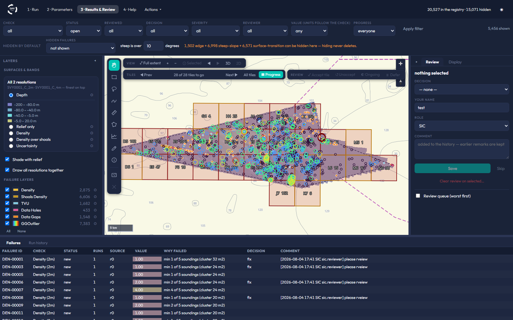
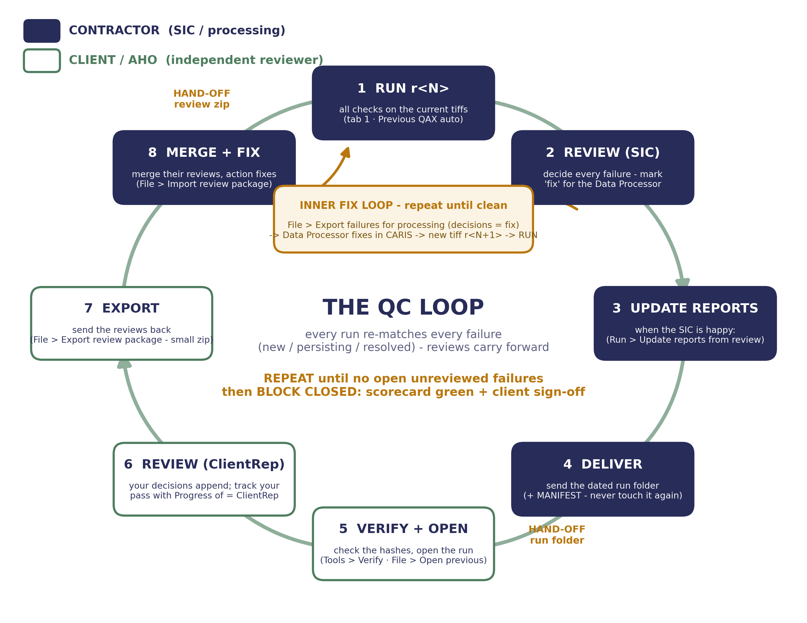

# QAX Loop React

> ## Please read before you use this
>
> **QAX Loop React is in active development and does not replace AusSeabed
> QAX.** It is published here for **evaluation and testing only**.
>
> **Final quality control of survey deliverables must be carried out with
> QAX GA.** Anything produced by this application should be treated as
> indicative, and checked against QAX GA before it is relied upon or
> delivered to a client.


Iterative bathymetry QC for hydrographic surveys. QAX Loop runs the
[AusSeabed QAX](https://github.com/ausseabed) grid checks over delivered
depth surfaces, remembers every finding from one delivery to the next, and
turns the review into client-ready reports.

This repository distributes the **Windows installer** for evaluation and
testing. The source code is proprietary to Reach Subsea and is not
published here.



## Download

Get the latest `QAXLoopReact-Setup-<version>.exe` from the
[Releases page](../../releases/latest).

Verify it before installing. The SHA-256 of every release is printed in its
release notes:

```powershell
Get-FileHash .\QAXLoopReact-Setup-0.15.12.exe -Algorithm SHA256
```

## Install

Double-click the installer. It installs **per user**, so it needs no
administrator rights, and it brings everything with it: no Python, no GDAL,
no internet connection required.

Requirements: Windows 10 or 11 (64-bit), about 600 MB of disk space. The
Microsoft WebView2 runtime is used for the interface; it ships with current
Windows, and the installer stages it if it is missing.

## What it does

1. **Run the checks** over the surfaces of a delivery: density, resolution,
   total vertical uncertainty, data holes and gaps, shoal density, and
   GGOutlier depth spikes. Each grid is clipped to its survey block first,
   so the ragged survey edge does not register as failures.
2. **Compare against the previous delivery.** Every finding keeps its
   identity between runs and is classified as new, still open, fixed, or
   reopened - so you can watch a block converge instead of re-reading the
   same failures every week.
3. **Review on a map.** Failure layers by check, tile-by-tile progress,
   filters, three reviewer roles with sign-off, ENC chart backdrops, a 3D
   seabed view, and any extra GeoTIFF you want to compare against. The same
   decisions can be made in QGIS.
4. **Produce the deliverables**: QC report PDF, Excel workbook, QC ledger
   and block summary, all generated from the reviewed state.



## Test data

You need three-band GeoTIFFs (depth, density, uncertainty) in a projected
metre CRS to try it properly. If you do not have survey data to hand, ask
us for the DEMO01 evaluation dataset: a synthetic survey block delivered at
1, 2, 4 and 8 m across three revisions with defects planted for every
check, plus the boundary and feature shapefiles. It is fully synthetic, so
there is no data-sharing question.

## Status and intended use

This is a development build. The checks it runs are the AusSeabed QAX
engines, used unmodified and pinned to specific upstream commits, so the
numbers should agree with QAX GA - but the surrounding application (the
cross-run registry, the review workflow, the reports) is still evolving,
and behaviour can change between releases.

Use it to explore the workflow and to give feedback. **Do not use it as
the QC of record.** For final quality control of survey deliverables, use
QAX GA.

## Licence

Free to install and use for evaluation and testing, and for internal use
with survey deliverables. You may pass the unmodified installer on to
colleagues. You may not sell it or present it as your own work. The
software is provided **as is**, without warranty of any kind.

Full terms in [`licenses/EULA.txt`](licenses/EULA.txt).

QAX Loop bundles open-source components under their own licences,
including the AusSeabed QAX check engines, GGOutlier (Apache-2.0), and Qt
for Python (PySide6, LGPL-3.0). See
[`licenses/THIRD_PARTY_LICENSES.txt`](licenses/THIRD_PARTY_LICENSES.txt)
and the LGPL source-availability notice in
[`licenses/PySide6-LGPL-NOTICE.txt`](licenses/PySide6-LGPL-NOTICE.txt).

The check engines are used **unmodified**, pinned to specific upstream
commits, so results are comparable with AusSeabed QAX's own.

## Feedback

Please open an issue on this repository: what you ran, what you expected,
what happened. Screenshots of the run log help.

---

(c) Reach Subsea. QAX Loop React is developed by the Reach Subsea survey
department.
